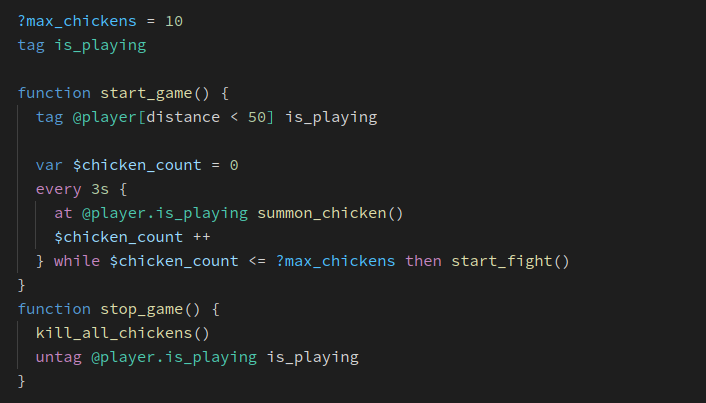

# Minity
> A scripting language for Vanilla Minecraft

## What it is

Minity is a scripting language which compiles to Vanilla Minecraft datapacks. It will allow you to develop complex datapacks in just a few files, and make your work easier by providing intuitive syntax for using some of the most powerful, but also hardest to use, Minecraft commands.

For some examples of what minity can do, see [Features](/features). To get started, see [Quick start](/getting-started).

Also check out the examples and [full syntax docs](syntax/basics.md). Or just read on to get started.

## Contribute

- <b>Want to help?</b> Check out how you can [contribute](#contributing), and/or [support us on Patreon](https://www.patreon.com/minity).
- <b>Have questions?</b> Join out [discord server](https://discord.gg/DnY7nDzdzm).
